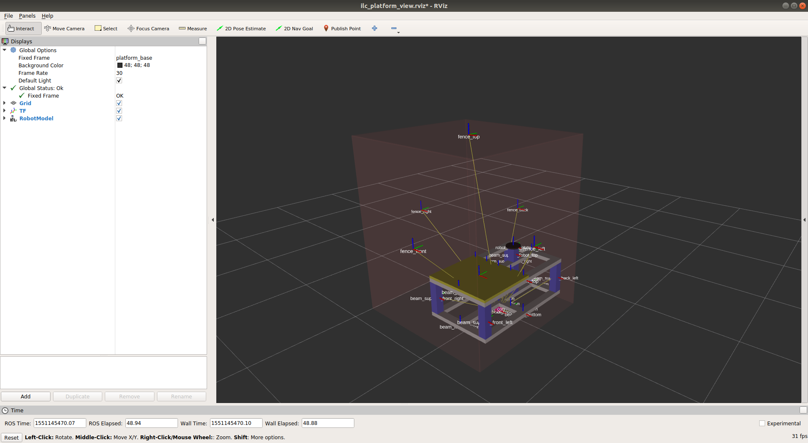

How to Change the Size of the Platform and Fences
=================================================

The design of the ilc_platform combined with fences are
in ``examples/random_pick/random_pick/urdf/ilc_platform/ilc_platform.urdf.xacro``.

You can explore the details of the design in Rviz by running:

.. code-block:: bash

  roslaunch random_pick visualize_ilc_platform.launch

The ilc_platform and fences are integrated with the UR5 robot
in ``examples/random_pick/random_pick/urdf/ur5_plus/ur5_hitbot_ilc_platform.urdf.xacro``.

You can change the size of the ilc_platform and fences in the following lines:

.. code-block:: xml

  <!-- platform -->
  <xacro:include filename="$(find random_pick)/urdf/ilc_platform/ilc_platform.urdf.xacro" />
  <xacro:platform platform_height="0.32"
                  platform_width="0.7"
                  platform_length="0.98"
                  connected_to="world"
                  xyz="0 0 0"
                  rpy="0 0 0"
                  up_beam="false"
                  fence_left_dist="0.5"
                  fence_right_dist="1.0"
                  fence_front_dist="0.8"
                  fence_back_dist="0.6"
                  fence_top_height="1.75"
                  fence_transparent="0.1"/>

If you change the values in the above lines in the two files,
you can immediately see the result by running:

.. code-block:: bash

   roslaunch random_pick visualize_ur5.launch

At the same time, the table and fences will also be changed
in the MoveIt scene.
