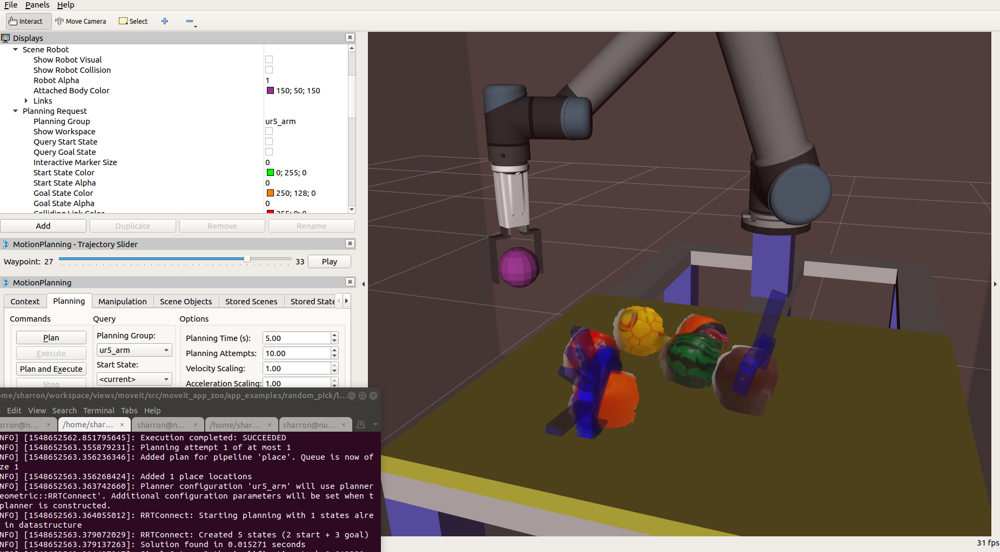

Random Pick (OpenVINO Grasp Detection)
======================================

Overview
--------
A simple application demonstrating how to pick up objects from clutter scenarios with an industrial robot arm.
The application takes grasp detection results from `OpenVINO GPD`_,
transforms the grasp pose from camera view
to the robot view with the `Hand-Eye Calibration`_,
translates the `Grasp Pose`_ into `moveit_msgs Grasp`_,
and uses the `MoveGroupInterface`_ to pick and place the object.
Watch this `demo_video`_ to see the output of this application.

.. raw:: html

   <iframe width="700px" height="394px" src="https://www.youtube.com/embed/b4EPvHdidOA?rel=0" frameborder="0" allow="autoplay; encrypted-media" allowfullscreen></iframe>

.. _demo_video: https://www.youtube.com/embed/b4EPvHdidOA?rel=0

.. _OpenVINO GPD: https://github.com/sharronliu/gpd/blob/master/tutorials/tutorial_openvino.md

.. _Hand-Eye Calibration: https://github.com/crigroup/handeye

.. _Grasp Pose: https://github.com/sharronliu/gpd/blob/libgpd/msg/GraspConfig.msg

.. _moveit_msgs Grasp: http://docs.ros.org/api/moveit_msgs/html/msg/Grasp.html

.. _MoveGroupInterface: https://ros-planning.github.io/moveit_tutorials/doc/pick_place/pick_place_tutorial.html

Requirement
-----------
Before running the code, make sure you have followed the instructions below
to setup the robot to work with MoveIt
The setup includes installing necessary robot URDF files,
the MoveIt configures and SRDF files, and ROS driver for the robot control.

- Hardware

  - Host running ROS2/ROS (sim/real)

  - RGBD sensor (real)

  - `Robot Arm`_ (real)

  - `Robot Gripper`_ (real)

- Software

  - `ROS Melodic`_ Desktop-Full (sim/real)

  - `MoveIt`_ (sim/real)

  - Universal Robot (sim/real)

    - :doc:`Setup UR5 with MoveIt <./ur5_setup_with_moveit>`

  - RGBD Sensor (real)

    - `realsense`_

  - `Hand-eye Calibration`_ (real)

  - `Grasp Pose Detection`_ (sim/real)

    - :doc:`GPD Setup <./gpd_setup>`

``sim``: required for simulation. ``real``: required for real robot execution.

.. _Robot Arm: https://www.universal-robots.com/products/ur5-robot

.. _Robot Gripper: https://www.universal-robots.com/plus/end-effectors/hitbot-electric-gripper

.. _ROS Melodic: http://wiki.ros.org/melodic/Installation/Ubuntu

.. _MoveIt: https://ros-planning.github.io/moveit_tutorials/doc/getting_started/getting_started.html#install-moveit

.. _hitbot: https://www.universal-robots.com/plus/end-effectors/hitbot-electric-gripper

.. _realsense: https://github.com/intel-ros/realsense

.. _Grasp Pose Detection: https://github.com/sharronliu/gpd/tree/libgpd

.. _OpenVINO: https://github.com/sharronliu/gpd/blob/master/tutorials/tutorial_openvino.md

Download and Build the Application
----------------------------------
Within your catkin workspace, download and compile the example code

.. code-block:: bash

  cd <path_of_your_catkin_workspace>/src

  git clone https://github.intel.com/otc-rse/moveit_app_zoo.git && cd ..

  catkin config --extend /opt/ros/${ROS_DISTRO} --cmake-args -DCMAKE_BUILD_TYPE=Release -DUSE_OPENVINO=ON -DBUILD_RANDOM_PICK=ON

  catkin build

- Build Options

  - USE_OPENVINO (ON | **OFF** ) Switch on/off openvino grasp detection
  - BUILD_RANDOM_PICK (ON | **OFF** )
    Switch on/off building of this application

Launch the Application with Fake Control and Recorded PointCloud
-----------------------------------------------------------------------
- Launch a UR5 fake controller, following instruction :doc:`./launch_robots`

  To view visual outputs, load rviz configure specific for this application from
  `moveit_example_app/examples/random_pick/random_pick/rviz/grasp.rviz`.

- Play recorded PointCloud from ``data/random_pick.pcb``:

.. code-block:: bash

  roslaunch random_pick camera.launch sim:=true

- Launch the application

.. code-block:: bash

  roslaunch random_pick random_pick.launch

- Launch the OpenVINO grasp detection

.. code-block:: bash

  roslaunch random_pick gpd.launch device:=0 plane_remove:=true

Launch the Application with Real Robot and Camera
-------------------------------------------------
- Launch a UR5 real controller, following instruction :doc:`./launch_robots`

  To view visual outputs, load rviz configure specific for this application from
  `moveit_example_app/examples/random_pick/random_pick/rviz/grasp.rviz`.

- Launch the camera and publish hand-eye static TF frame

.. code-block:: bash

  roslaunch random_pick camera.launch

- Launch the application

.. code-block:: bash

  roslaunch random_pick random_pick.launch

- Launch the OpenVINO grasp detection

.. code-block:: bash

  roslaunch random_pick gpd.launch device:=0 plane_remove:=true

.. caution:: Even though the application runs well on a fake controller,
             some unexpected motion planning or execution results
             would still happen on a real robot. For the sake of safe operation,
             it's strongly recommended the operator keeps touching
             the "emergency stop" button of the robot and
             being ready to press that button timely in case of necessity.

Customization Notes
-------------------
:device [0|1|2|3]: Configure device for grasp pose inference to execute, 0 for CPU, 1 for GPU, 2 for VPU, 3 for FPGA.
  In case OpenVINO plug-ins are installed, this configure deploy the CNN based deep learning inference on
  to the target device. Deploying the inference onto **GPU** or **VPU** will save CPU loads for other computation tasks.

:plane_remove [false|true]: Configure whether or not remove the planes (like the table plane) from point cloud input.
  Enabling this helps to avoid generating grasp poses across the table.

:target_frame_id ["base"|"string"]: Frame id expected for grasps returned from this service.
  When this parameter is specified, Grasp Planner try to transform the grasp from the original frame
  (usually a camera's color frame) to this target frame, given the TF available.

:place_position [[-0.45, -0.30, 0.25]|[1*3 double]]: Place position {x, y, z} in the target_frame_id.

:joint_values_place [[1*6] double]: Place position in joint values. For each place,
  this parameter specifies the target joint values for the arm moving to the place position.

:joint_values_pick [[1*6] double]: Pick position in joint values. For each pick,
  this parameter specifies the target joint values for the arm moving to the pre-pick position.
  This position is usually above the work table.

:finger_joint_names [[1*2] string]: Joint names of gripper fingers. Joint names are filled into MoveIt's grasp interface,
  to control the posture of hand for the position of 'pre_grasp_posture' and 'grasp_posture'
  (see `moveit_msgs::msg::Grasp <http://docs.ros.org/api/moveit_msgs/html/msg/Grasp.html>`_).
  Joint names are usually defined in URDF of the robot hand.

:finger_positions_open [[1*2] double]: Positions of all finger joints when the hand is in open status.

:finger_positions_close [[1*2] double]: Positions of all finger joints when the hand is in close status.

:eef_yaw_offset [PI/4|double]: The end-effector's yaw offset to its parent link.

:boundry [[1*6] double]: Workspace boundy, described as a cube {x_min, x_max, y_min, y_max, z_min, z_max}
  in metres in the target_frame_id.

:object_height_min [0.028|double]: Minimum height in metres (altitude above the work table) of object to grasp.

:kThresholdScore [20|float]: Minimum score of grasp.

:grasp_approach [[0, 0, -1]|[1*3] double]: Expected grasp approach direction.

:approach_deviation [PI/9|double]: Maximum deviation angle to the expected approach direction.

:grasp_position_offset [[1*2] double]: Grasp position offset introduced by the system (e.g. camera, hand-eye calibration, etc.)
  {x_offset, y_offset} in metres in the target_frame_id.

* :doc:`./platform_fence_customization`

Troubles Shooting
-----------------
* MoveIt pick() motion planning has a known Inverse Kinematics issue also observed in the
  `pick_place app <https://github.com/ros-planning/moveit_tutorials/tree/melodic-devel/doc/pick_place>`_ of MoveIt Tutorial,
  which may result in IK failure or uncomfortable IK result.
  We reported the issue as `#1278 <https://github.com/ros-planning/moveit/issues/1278>`_ and provided a workaround.
  Try rebuild moveit_core with this workaround.

* "moveit_kinematics" build failure with "ur3_kin" and "ur_kinematics". This could be introduced by previously built artefacts.
  Try remove the folder "build/devel/share/ur_kinematics", "devel/share/ur_kinematics", then rebuild "moveit_kinematics".

.. toctree::
   :hidden:

   gpd_setup.rst
   ur5_setup_with_moveit.rst
   launch_robots.rst
   platform_fence_customization.rst
